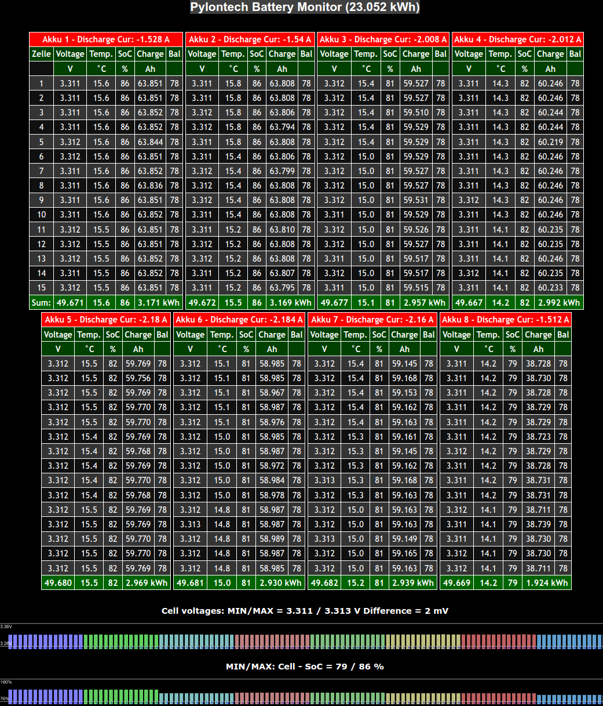

# Pylontech Battery Monitor

The Pylontech Battery Monitor is connected via a serial connection to the "Console" port of the master battery. It automatically detects the number of installed batteries and reads their values. The battery information is displayed on a local webpage and is also published to an MQTT broker. A setup page is used for MQTT configuration.

## Supported Hardware:
Raspberry PI: recommended for lowest power consumption is the Raspberry PI Zero W,
but any other SBC is also compatible.

## Connection:
Connect the Console connector of the master battery to the primary serial interface of the Raspberry Pi using an RS-232 to TTL (3.3v) converter.

## Install required libraries:
Run the script named `prepare` to install necessary libraries.

## Build the software:
make clean 
make 
This process will create the executable file named `pylonmonitor`.
## Run the software:
Run the software with root privileges by executing `./pylonmonitor`.

## Raspi supporting WLAN (RPI3, 4 and Zero-W) need remapping of serial port:
1. Disable serial login shell (important !!! Double check this step) 
    Enter `sudo raspi-config` in the terminalbr>
    InterfaceOptions - Serial Port: 
    login shell: NO 
    hardware enabled: YES 
2. map primary serial port to connector pins 
    sudo nano /boot/config.txt and add at the end: 
    dtoverlay=miniuart-bt 
3. Reboot and verify configuration: 
    ls -l /dev/serial* 
    serial0 should map to ttyAMA0 
4. Programs using `ttyAMA0` must be run with root privileges

## Number of Pylontech Batteries:
The software automatically detects the number of connected Pylontech batteries.

## Autostart (for RPI only):
Refer to the autostart.txt file for instructions on setting up the software to start automatically.

## Using the pylontech battery monitor:
1. via Web interface: Access the Raspberry Pi's IP address in a web browser. 
2. Click on "SETUP" in the top right corner of the web interface to configure network settings and MQTT. 
3. Use tools like MQTT Explorer to verify that everything is working as expected

## safe your SD card:
This is applicable to Raspberry Pi OS (formerly Raspbian):

This program saves its configuration on the SD card. Once correctly configured, it will not perform any further write operations to the SD card. Begin by setting up the program, configuring the MQTT settings, and if necessary, the network settings. Next, enable the Overlay File System by following these steps:

1. Enter the Raspberry Pi configuration tool with: `sudo raspi-config`
2. Navigate to: **Performance Options**
3. Select **Overlay File System**: Enable the overlay file system and set the boot partition to read-only.
4. Exit the configuration tool and reboot your Raspberry Pi.

After these steps, no further data will be written to the SD card, significantly reducing the risk of SD card wear or corruption.

## Web Interface:

